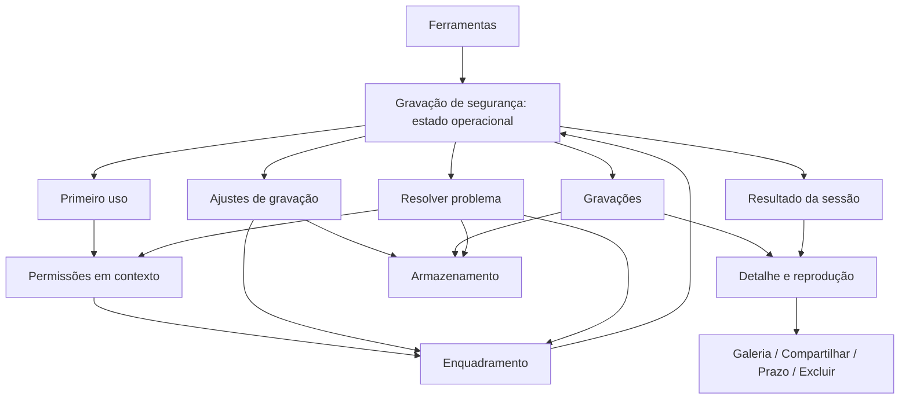

# Especificação de produto e UX — Gravação de segurança

Data: 2026-09-11. Status: proposta pronta para revisão e decomposição; não representa UI implementada ou homologação em aparelho. Base funcional: `CalcMot-epic-1`; evidências em [camera-current-state-audit.md](camera-current-state-audit.md).

## 1. Resultado de produto e autoridade

O motorista consegue responder em um olhar: **está gravando áudio e vídeo? como paro? onde encontro o resultado? até quando ele fica disponível?** Qualidade premium significa controle previsível, conteúdo legível, poucas decisões e recuperação honesta. Não significa mais cards, animações, selos ou configurações.

Nome de entrada e de área: **Gravação de segurança**. “Câmera secreta” deixa de ser nome de descoberta. Não existe modo oculto, disfarce, supressão dos indicadores Android, gravação acionada por Uber/99, AccessibilityService, oferta, reboot ou encerramento de processo. Continuidade é de uma sessão explicitamente iniciada, quando plataforma e aparelho a sustentam.

Esta proposta preserva os AD-1–AD-14 da architecture spine de 2026-08-24/25: vertical isolada, máquina de estados, single writer, arquivos privados, retenção e operações independentes. É o **delta proposto de experiência** sobre DESIGN/EXPERIENCE anteriores, ambos parciais. Não sobrescreve silenciosamente documentos canônicos. CAM-001 deve reconciliar nomes, IA e linguagem nos contratos anteriores antes de agentes implementarem novos fluxos.

Decisões de produto propostas aqui: Hub vira superfície operacional; ajustes saem da preparação; disclosure de primeiro uso antecede permissões; retorno preparado tem um único CTA explícito de início; o privado usa retenção padrão de 24h; não repetir modal genérico a cada sessão após disclosure vigente aceito. Repetir disclosure se finalidade/política aprovada mudar, não simplesmente por abrir a tela. Texto de transparência para passageiros e base jurídica permanecem gate de publicação, não são resolvidos por um checkbox do motorista.

Não introduzir nova stack. Preservar baseline do projeto e pins aprovados CameraX 1.6.1, Media3 1.11.0, Room 2.8.4 e WorkManager 2.11.2 onde ainda necessários. São decisões do projeto, não alegação de que sejam as últimas versões. Fontes oficiais consultadas: [CameraX releases](https://developer.android.com/jetpack/androidx/releases/camera), [Media3 releases](https://developer.android.com/jetpack/androidx/releases/media3). Revalidar compatibilidade no início da história técnica; upgrade geral é outro escopo.

## 2. Evidência competitiva e oportunidades

Pesquisa secundária local: digests de 2026-08-21 de Zeca/GigU/rebU em `docs/project-artifacts/planning-artifacts/research/competitive-camera-de-seguranca-para-motoristas-zeca-2026-08-21/`; pesquisa de mercado em `docs/research/mercado-copilotos-financeiros-brasil-2026-09-10.md`. Rechecagem primária nesta auditoria:

| Produto / fonte consultada | O que a fonte realmente sustenta | Limite / implicação para CalcMot |
|---|---|---|
| [Zeca — ficha oficial](https://play.google.com/store/apps/details?id=co.zeca.app&hl=pt_BR), atualização exibida 09/09/2026 | Promove câmera e automação com posicionamento de ocultação | Não prova lifecycle, recuperação ou UX real. Rejeitar esse posicionamento; reduzir toques sem captura automática |
| [GigU — ficha oficial](https://play.google.com/store/apps/details?id=co.gigu.app&hl=pt_BR), atualização exibida 26/08/2026 | Promove áudio/vídeo de segurança e câmera gratuita | Câmera isolada não é diferencial comercial defensável. Não inferir comportamento técnico da ficha |
| [rebU — ficha oficial](https://play.google.com/store/apps/details?id=com.uberdomarlon.rebu&hl=pt_BR) | Descreve câmera frontal e continuidade com app fechado/tela apagada | “Fechado” é termo impreciso; CalcMot distingue recentes, processo encerrado e force-stop |

Nenhum concorrente foi instalado ou observado nesta rodada. Não há estudo comparativo cronometrado, entrevistas ou prova de superioridade. **Superioridade é hipótese de produto a testar**, com critérios abaixo. As fichas descrevem promessas, não permitem concluir que concorrentes não tenham boas telas ou recuperação.

| Oportunidade | Decisão concreta | Valor verificável / rejeição de gimmick |
|---|---|---|
| Início sem atrito | Configuração válida lembrada; uma ação em tela operacional; primeiro uso separado | Usuário recorrente não escolhe segmentos/qualidade a cada início |
| Clareza | Texto Gravando + REC + duração capturada + Parar | Sem brilho pulsante, radar, scanner ou “escudo ativo” que prometa proteção |
| Organização | Uma sessão lógica por início/fim, arquivos internos agregados | Sem poluir histórico com um item por MP4 |
| Associação | Associar somente segmentos, pausas e resultado à sessão local | Sem cruzar oferta, passageiro, rota, Uber/99 ou ledger. Sem inferir corrida realizada |
| Recuperação | Resultado distingue íntegra, parcial, sem trecho confirmado e pendente de reconciliação | Nunca “recuperada com sucesso” só porque um arquivo existe |
| Espaço | Bloquear início inseguro; parar antes de perder reserva; gerenciamento separado | Sem porcentagem decorativa de “saúde” ou tempo restante preciso sem perfil medido |
| Permissões | Explicar próximo recurso, pedir no contexto, reparar negativa permanente | Sem pedir acessibilidade/overlay para gravar ou lista de permissões na principal |
| Continuidade | Notificação nativa com ações; reentrada conecta à sessão | Sem prometer sobreviver a force-stop/reboot |
| Energia / calor | 480p qualificado, preview só sob demanda, monitor térmico suportado | Sem promessa “zero bateria”, otimização milagrosa ou isenção de bateria obrigatória |
| Arquivo útil | Reprodução, galeria e compartilhamento são ações distintas | Sem badge de autenticidade judicial, garantia de prova, upload ou feed social |

## 3. Jornada ponta a ponta

João Batista é a persona já documentada em `docs/ux-persona-joao-batista.md`: Android intermediário/de entrada, trabalho longo, pressa, calor e baixa tolerância a configuração. A câmera herda a necessidade de clareza; não herda o switch de cálculo como controle de gravação.

1. **Antes de dirigir:** João abre menu → Ferramentas → Gravação de segurança. A navegação é passiva: não abre câmera, microfone ou FGS.
2. **Primeiro uso:** lê finalidade, destino privado, prazo padrão, continuidade condicionada e limites; pode sair. A ação “Preparar gravação” inicia preparação, não captura.
3. **Permissões:** autoriza câmera e microfone com explicação contextual; notificações são explicadas como controle fora do app. Negar um recurso não bloqueia biblioteca ou o restante do CalcMot.
4. **Enquadramento:** abre prévia real, mantém frontal se disponível, ajusta suporte do celular e confirma “Usar este enquadramento”. A prévia usa câmera, mas não grava arquivo. Ao sair, libera a prévia. Escolhas avançadas permanecem em Ajustes.
5. **Pronto:** tela operacional mostra “Pronto para gravar”, “Câmera frontal · áudio autorizado” e “Temporário por 24h após encerrar”, com “Iniciar gravação”. Revalidação de precondições ocorre no início; pronto não promete posse futura de câmera/microfone.
6. **Início:** após toque explícito em Activity visível, mostra “Iniciando gravação…” sem REC. Só confirmação de captura A/V permite Gravando. Não iniciar automaticamente após conceder a última permissão.
7. **Durante:** vê Gravando, duração capturada e Parar; Pausar é secundário quando engine habilitado. Pode alternar app; a notificação permite controlar sem navegar por menus. A troca interna de arquivos informa a interrupção transitória e registra lacuna.
8. **Interrupção:** se recurso se perder, a UI deixa de afirmar A/V; encerra com segurança e explica a causa. Não retoma sozinha. Pausa voluntária é diferente de interrupção terminal.
9. **Fim:** Parar envia comando único; Finalizando remove REC e bloqueia nova captura até entrega segura de recursos. Não exige confirmação de parada, que atrasaria controle crítico.
10. **Clímax de confiança:** resultado mostra “Gravação disponível”, duração confirmada, eventual trecho/lacuna e prazo exato. “Ver gravação” abre aquela sessão, sem busca pela biblioteca.
11. **Preservação:** João pode “Salvar na galeria”. Só publicação verificada confirma cópia independente. Compartilhar pelo Android é outra ação; cancelar não altera retenção.
12. **Depois:** encontra sessão por dia e hora no histórico, revê interrupções e gerencia privados no armazenamento. Ao expirar, o privado fica indisponível; galeria já publicada segue independente.

Usuário recorrente com setup e disclosure vigentes: entrada → Pronto → Iniciar gravação. Se aparelho/lente mudou ou enquadramento nunca foi confirmado, entrada → Ver enquadramento. Nada pede duração de segmento na jornada recorrente normal.

### Arquitetura de informação proposta



Mapa técnico de rotas é seed, não obrigação de renomear URI interna: manter `security-hub` como operacional; `security-configure` pode redirecionar ao enquadramento após setup; `security-active` reconecta ao mesmo container/estado; `security-library` preserva lista; `security-player/{sessionId}` evolui para detalhe ou redireciona sem perder ID. Novas rotas internas de primeiro uso, permissões, ajustes e armazenamento permanecem na vertical. Não reestruturar navegação global, Home ou dashboard financeiro para esta entrega.

## 4. Contrato de estado e controles

O serviço é único escritor durante captura; UI e notificação projetam o mesmo snapshot. Persistência responde por resultado e disponibilidade; não usar preferências ou `remember` como autoridade de gravação. Runtime desconectado não é Gravando e também não significa arquivo perdido: reconciliar antes de permitir Start.

| Fase / projeção | Conteúdo principal | CTA dominante | Secundária / regras |
|---|---|---|---|
| Recuperando estado | “Verificando gravações anteriores…” | Nenhum Start | Pode sair; biblioteca pode mostrar resultado pendente |
| Não configurado | “Prepare sua gravação” + uma pendência acionável | Preparar gravação / Resolver pendência | Gravações, Ajustes; sem checklist de recursos |
| Pronto | “Pronto para gravar”; resumo lente/áudio; prazo padrão | Iniciar gravação | Ver enquadramento, Gravações; ajustes no menu |
| Iniciando | “Iniciando gravação…”; sem REC, sem duração inventada | Cancelar início | Serializar cancelamento com eventos; erro recuperável leva a causa |
| Gravando | “Gravando”; REC; duração capturada; “Áudio e vídeo ativos” | Parar gravação | Pausar; sair mantém sessão somente se serviço continuar confirmado |
| Pausando | “Pausando…”; sem promessa de pausa concluída | Parar gravação | Pausar/Retomar indisponíveis; transição não afirma REC |
| Pausado | “Pausado”; “Áudio e vídeo não estão sendo gravados”; tempo congelado | Retomar gravação | Parar gravação; não dizer que ícones de privacidade Android necessariamente somem |
| Retomando | “Retomando gravação…”; sem REC; tempo congelado | Parar gravação | Retomar não duplica; revalidar os dois recursos |
| Rotacionando | “Trocando arquivo…”; “Gravação temporariamente interrompida”; tempo congelado | Parar gravação | Só Parar; lacuna persistida, nenhum REC durante troca |
| Finalizando | “Finalizando gravação…”; sem REC | Nenhuma mutação de mídia | Voltar permitido; I/O continua no dono correto; nenhum botão que force sucesso |
| Encerrada | Vai a resultado específico | Ver gravação, se houver trecho válido | Nova gravação após recursos liberados; outras ações no detalhe |
| Falha | “Gravação interrompida” ou “Não foi possível iniciar”; causa concreta | Resolver problema | Ver trechos disponíveis, quando verificados; não afirmar perda total se reconciliação pendente |
| Estado não confirmado | “Não foi possível confirmar o estado” | Verificar estado | Sem novo Start concorrente; disponibilizar Parar ao dono ativo pelo gateway quando identificado |

`REC=true` exclusivamente em Gravando, com A/V observado. As demais fases são conservadoras e nomeiam transição, sem prometer que o usuário já deixou de ser gravado antes de confirmação. Cronômetro acumula apenas tempo capturado, não tempo total de sessão. Não é live region por segundo. Valores desconhecidos aparecem como “Ainda não confirmado”, nunca 0 por conveniência.

### Disponibilidade de arquivo é outro eixo

- Temporário AVAILABLE, EXPIRED ou DELETED; publicação NONE/COPYING/PUBLISHED/FAILED/MISSING; export IDLE/BUILDING/READY/FAILED. Não colapsar tudo em badge “Verificada”.
- Item pode mostrar “Temporário · até 12 set., 18:42” e “Cópia na galeria” juntos. Galeria publicada não altera prazo do privado nem significa armazenamento privado liberado.
- Integridade mínima e comparação de hash são controles internos, não garantia de autenticidade, resultado jurídico ou cobertura contínua. Lacunas ficam visíveis.
- Retenção: 24h padrão; 3, 7, 15 ou 30 dias opcionais. Snapshot no início, contado desde finalizedAt. Alterar padrão vale só para próximas sessões. Extensão só aumenta prazo total desde finalizedAt, nunca “mais 30 dias” a cada toque.
- Expiração lógica bloqueia novas operações imediatamente; exclusão física ocorre de forma recuperável. Operação reclamada antes do prazo pode terminar sem reativar privado. Exibir resultado real, inclusive cópia na galeria concluída depois da expiração.
- Galeria sem original disponível: “Abrir na galeria” se URI publicada verificável; sem prometer reexportar ou recompartilhar se o adapter não sustenta esse caminho. Compartilhamento da galeria exige caminho explicitamente validado; não reabrir privado expirado para isso.

## 5. Android e recuperação por cenário

Início de serviço camera/microphone depende de permissões e elegibilidade foreground; continuidade não concede direito de recriar serviço em background. O produto inicia somente com Activity visível. [Android — tipos de foreground service](https://developer.android.com/develop/background-work/services/fgs/service-types).

Notificação autorizada em API 33+ e canal operacional são **precondições do CalcMot**, embora POST_NOTIFICATIONS não seja requisito Android para iniciar todo FGS. Em APIs com bloqueio global/canal disponível, checar visibilidade operacional também. Nunca culpar o Android por uma escolha adicional do produto. [Android — permissão de notificações](https://developer.android.com/develop/ui/compose/notifications/notification-permission).

| Cenário | Comportamento e mensagem | Recuperação permitida |
|---|---|---|
| Câmera negada | Sem preview/captura. “Autorize a câmera para confirmar o enquadramento.” | Solicitar após ação; permanente → settings; biblioteca continua acessível |
| Microfone negado/ausente | “O áudio é necessário para esta gravação.” Não oferecer modo silencioso como fallback | Solicitar/reparar; não chamar permissão de prontidão real |
| Permissão de uso único expirada ou revogada | Rechecar no resume e writer. Se ativa, retirar afirmação A/V e encerrar seguro | Novo início explícito após reparo; sem auto-retry |
| Toggle de privacidade / fonte silenciada | Observar AudioStats/camera e interromper quando não há A/V confirmado | Explicar recurso; nunca capturar A/V unilateralmente sob rótulo completo. [AudioStats](https://developer.android.com/reference/androidx/camera/video/AudioStats) |
| Câmera ocupada / perfil 480p incompatível | “Câmera indisponível” / “Esta câmera não oferece a qualidade disponível.” | Voltar ao enquadramento; tentar novamente ou outra lente detectada, sem fallback silencioso |
| Chamada, assistente ou outro gravador | Recurso pode ser preemptado; não pedir telefone/contatos para prever chamada | Usar fatos do engine, preservar trechos e iniciar nova sessão após liberação |
| Pouco espaço antes do Start/troca | Bloquear admissão com “Libere espaço para gravar.” | Armazenamento; revalidar no retorno e no writer |
| Pouco espaço durante captura | Finalizar antes de perder reserva. “Gravação encerrada por falta de espaço.” | Resultado com trechos confirmados; gerenciamento; nunca apagar outra sessão silenciosamente |
| Aquecimento severo API 29+ | Parada controlada ao nível severe ou maior; “Gravação interrompida por aquecimento.” | Esperar aparelho esfriar; usuário inicia nova sessão. Em APIs anteriores, tratar erros e qualificar aparelho. [PowerManager](https://developer.android.com/reference/android/os/PowerManager) |
| Bateria baixa | Informação contextual somente quando acionável; não bloquear por percentual arbitrário nem mudar qualidade silenciosamente | Conectar energia se possível; não automatizar retomada. Calor em carregamento exige benchmark |
| Activity destruída/rotação | UI pode ser recriada; serviço permanece dono; captura mantém orientação/lente fixadas no início | Reconectar snapshot; configuração ainda não iniciada restaura escolhas e exige prévia quando necessário |
| Outro app / tela apagada / recentes | Manter sessão já iniciada se serviço/engine continuam confirmados | Notificação e reentrada. OEM pode encerrar: não garantir continuidade universal |
| Android “Parar app” | Pode remover processo/notificação sem callback | Na próxima abertura, reconciliar; jamais reiniciar captura. [Android — parada pelo usuário](https://developer.android.com/develop/background-work/services/fgs/handle-user-stopping) |
| Force-stop / processo morto / reboot | Sem câmera/microfone automáticos; marca intenção anterior como interrompida, não Gravando | Bootstrap verifica arquivos existentes antes de Start. Motivo exato só quando observado; senão “encerramento inesperado” |
| Arquivo parcial / Finalize com erro | Erro não basta para afirmar inutilidade; verificar trecho segundo política do código de erro | Promover somente amostras verificadas; manter pendente recuperável se commit falhar. [CameraX — Finalize](https://developer.android.com/reference/androidx/camera/video/VideoRecordEvent.Finalize) |
| Erro de banco após arquivo válido | Não perder associação de arquivo/intenção; nenhuma mensagem de sucesso antes do commit | Claim durável e reconciliação; não mandar MP4 válido para limbo irreversível |
| Falha no player | “Não foi possível reproduzir este trecho.” | Tentar novamente, voltar; não declarar mídia íntegra apenas por tracks existentes |
| Arquivo da galeria removido fora do app | MISSING; não repetir “Salvo na galeria” como disponibilidade atual | Se privado ainda elegível, criar nova publicação explicitamente; caso contrário informar ausência |

Política de armazenamento herda AD-6: admissão `usableBytes >= finalizedSessionBytes + 2 × estimatedNextSegmentBytes + 512 MiB`; monitor de captura preserva espaço para sessão atual + 512 MiB. Rotação por duração configurada ou 1 GiB, o que ocorrer primeiro. Estimativa depende de perfil medido e bitrate observado. Não mostrar minutos restantes com a constante atual de 45 MiB/min como se fossem garantia.

## 6. Extensão do Design System CalcMot

### Marca, cor e superfícies

Nenhuma cor nova. Aliases abaixo são especificação semântica proposta, não tokens já implementados.

| Papel da câmera | Token existente / regra |
|---|---|
| Fundo | `CalcMotColors.AppBackground` #04060A; manter barras Android compatíveis e ícones claros |
| Superfície normal | Surface #0B1016; superfície de estado central pode usar HeroSurface com scrim legível |
| Sheet/dialog | SurfaceElevated #101720; scrim nativo; sem bordas fluorescentes |
| Separação | BorderSubtle; borda não é única indicação de foco/seleção |
| Texto | TextPrimary / TextSecondary / TextMuted; metadados não recebem alpha adicional sem contraste medido |
| Marca/estado pronto | BrandAccent/Success #61E329 com rótulo; não representa gravação |
| `camera.action.primary` | BrandPrimaryDark #0F55D9 + TextPrimary para texto normal; preserva o azul CalcMot e melhora contraste sobre BrandPrimary |
| `camera.action.stop` / destrutiva preenchida | Danger #FF6670 + TextInverse #111111; branco atual sobre Danger é reprovado |
| REC / falha | Danger como texto/ícone sobre superfície escura; sempre acompanhado de nome de estado |
| Pendência/pausa/expiração próxima | Warning #FFC453; ausência esperada de autorização não usa card vermelho |
| Neutro | Temporário com prazo normal usa TextSecondary; não transformar toda gravação temporária em alerta amarelo |

Se wrappers atuais não permitem foreground adequado, evoluir API do DS de maneira opt-in e revisável, ou componente da vertical que componha o botão aprovado; não duplicar hex nem alterar default global sem revisão de consumidores. Gate visual requer contraste real de estados enabled/focused/pressed, incluindo overlays de estado. Base: 4,5:1 texto normal; 3:1 texto grande e elementos funcionais. [WCAG — contraste](https://www.w3.org/WAI/WCAG22/Understanding/contrast-minimum.html).

### Tipografia, ritmo e forma

| Papel | Especificação |
|---|---|
| Título de rota | SectionTitle 18sp bold na topbar; título de conteúdo só quando comunica estado diferente |
| Estado principal | ScreenTitle 24sp bold; uma unidade de estado, sem título “Estado” acima |
| Cronômetro | MetricHero 28sp bold; números tabulares se fonte suportar; H:MM:SS para sessões ≥1h |
| Título de sessão/linha | CardTitle 16sp semibold |
| Orientação/causa | Body 14sp normal; principal legível sem depender de caption |
| Metadados | Caption 12sp medium; nunca único lugar de ação crítica/prazo próximo |
| Botão | Button 15sp bold, texto exato; cresce com fonte, mínimo 48dp de toque |

Espaçamento: Xxs 2, Xs 4, Sm 8, Md 12, Lg 16, Xl 24, Xxl 32dp. Margem horizontal `ScreenHorizontal=16dp`; vertical `ScreenVertical=20dp`; `CardPadding=16dp`; `CardGap=12dp`; `SectionGap=20dp`. Usar 8dp entre estado e explicação; 12dp entre itens do mesmo conjunto; 20dp entre blocos; 24dp antes de ações quando houver conteúdo. Não usar Spacer ponderado para empurrar CTA para fora de tela pequena.

Raio: cards simples/botões Sm 10dp; preview e superfície operacional central Lg 20dp como extensão controlada do papel hero já existente; sheet Xl 28dp no topo; badges Pill. Não mudar raio global de `CalcMotCard`. Elevação: None/Low para listas/cards, Medium para sheet/dialog conforme DS, Overlay somente quando sobreposição real. Profundidade por tons, sem sombra vermelha, blur em câmera ou bitmap decorativo pesado.

### Componentes e hierarquia

| Componente proposto | Base / contrato |
|---|---|
| RecordingScaffold | CalcMotScaffold/TopBar; um dono dos insets; slot de conteúdo e barra de ação. Sem scaffold por card |
| RecordingStateHeader | Estado + ícone semântico + explicação + duração opcional. Mesma geometria entre Pronto/Gravando/Pausado/Transições; não reconstruir tela a cada estado |
| RecordingActionBar | Uma ação dominante; no máximo uma ação de sessão secundária; altura mínima proposta 56dp, toque ≥48×48; jamais cobrir conteúdo |
| RecordingPreview | Superfície funcional com ratio do buffer transformado; mostrar todo o quadro gravado com letterbox quando preciso; placeholder textual em loading/falha; nada de falso frame |
| RecordingSessionRow | Uma área navegável por sessão, três linhas lógicas; data/hora, duração, prazo/resultado; ícone neutro, sem thumbnail de passageiro por padrão |
| RecordingIssueInline | Uma causa prioritária + ação; sem stack de banners. Erro terminal fica persistente; snackbar não é único local de falha |
| RecordingSettingRow | Linha de label, valor, chevron; divisor; sem card por preferência. Toggle somente para opção booleana real, nunca Start |
| RecordingAvailability | Texto de privado e galeria separados; alerta “Expira em breve” apenas nas últimas 2h, limiar proposto testável |
| RecordingPlayer | Controles Media3 acessíveis agrupados; tempo/scrub no player; botão de reprodução tem nome e estado; sem slider permanente de volume |
| RecordingEmptyState | Ícone Material discreto, título, uma frase e CTA pertinente; sem ilustração de vigilância ou grande card aninhado |
| RecordingLoading | Indicador indeterminado com tarefa nomeada; skeleton somente para metadados/lista. Nunca porcentagem sem trabalho total conhecido |

Botões: azul para iniciar/retomar/preservar; outlined neutro para secundárias; stop Danger com foreground contrastante; exclusão no detalhe/armazenamento após confirmação. Parar não pede confirmação e não usa hold-to-stop. Após STOP aceito, Finalizando; rejeição de revisão atualiza snapshot e tenta novamente somente como reconciliação do mesmo comando/intenção quando elegível, nunca inicia captura nova.

Ícones: Material Outlined Videocam, CameraAlt, Mic, Notifications, VideoLibrary/Folder, Storage, Settings, Info, ErrorOutline; filled Pause/PlayArrow/Stop para transporte, auto-mirrored ArrowBack quando aplicável. Ícones 24dp, recipiente de toque 48dp; rótulos visíveis nas ações principais. Ícones decorativos `contentDescription=null`. Small icon Android deve ser asset monocromático dedicado aprovado, não launcher mipmap.

Dialogs para confirmação destrutiva; sheets para escolha curta/explicação contextual; tela para fluxo multi-etapa de reparo. Sheet de prazo lista opções como um grupo de radio acessível, não duas fileiras de segmented controls. Não empilhar modais. Ao fechar, devolver foco ao invocador. Snackbar apenas confirmação auxiliar de operação concluída; “Salvo na galeria” também deve aparecer no detalhe persistido.

### Acessibilidade, responsividade e interação

- Alvos ≥48×48dp com espaçamento que evite expansão sobreposta; botões principais com altura mínima 56dp proposta. Requisito Android: [touch targets](https://developer.android.com/guide/topics/ui/accessibility/views/apps-views).
- TalkBack: anunciar entrada da rota, heading principal, mudança Gravando/Pausado/Falha/Finalizando; cronômetro não anuncia a cada segundo. Estado combina texto e ícone, nunca só verde/vermelho.
- Sliders têm label e range de tempo falado; alternativa acessível de avançar/voltar; player não depende só de gesto. Sem autoplay, som de início obrigatório ou vibração que contradiga preferências do sistema.
- 320×568dp, 360×800dp, 393×852dp e 852×393dp são tamanhos propostos de QA; fontes 1,0/1,3/2,0. Conteúdo e ações crescem; primária continua alcançável; ações empilham se não couberem. Topbar pode usar título curto “Gravação” sem perder nome acessível completo.
- Layout normal é uma coluna. Em altura compacta, preview diminui dentro de bounds legíveis ou conteúdo rola; manter quadro inteiro e controle alcançável. Não forçar landscape a imitar vertical com altura fixa 220dp.
- Barra de ação respeita gesture/3-button navigation, cutout, IME quando houver e safe areas; conteúdo recebe espaço da barra uma única vez. `SecurityPage` atual exige medição para eliminar padding duplicado sem presumir defeito.
- Motion usa Fast 120 / Medium 180 / Slow 250ms; transições curtas e discretas, obedecem escala de animação. REC estático, sem piscar; estado confirmado nunca espera animação para aparecer.
- Playback pausa ao sair do foreground e antes de iniciar captura; não interrompe nem mistura áudio com uma sessão ativa. Não criar serviço de reprodução em background.

## 7. Especificação de todas as superfícies-alvo

### Direção visual obrigatória: ferramenta operacional CalcMot

O redesenho é uma recomposição de UX/UI, não um reskin dos cards atuais. A base técnica continua Compose nativo; sua biblioteca de componentes não deve determinar a composição do produto. Material oferece comportamento de toque, foco, diálogo e acessibilidade; componentes próprios da câmera determinam agrupamento, proporções, estados e acabamento. Não substituir a base nativa por Canvas de controles, imagens clicáveis ou componentes sem acessibilidade.

**Orçamento de carga cognitiva:** na principal pronta, quatro grupos de leitura no máximo: estado, resumo de gravação, prazo e ação. Na principal ativa, três: estado A/V, tempo, controles. Uma pendência acionável substitui o resumo normal, sem empilhar diagnóstico. Nenhum card individual para câmera, microfone, notificações, qualidade ou espaço. Usuário recorrente toma uma decisão: iniciar; durante captura, uma decisão dominante: parar.

| Decisão de composição | Especificação de acabamento / reprovação |
|---|---|
| Alinhamento | Topbar à esquerda; estado/tempo no mesmo eixo central da superfície operacional; listas e ajustes à esquerda. Não alternar centralizado/esquerdo em cada bloco |
| Peso | Estado 24sp; tempo 28sp; explicação 14sp; uma ação preenchida 56dp mínimo. Não criar três títulos grandes para a mesma informação |
| Superfície operacional | No máximo um painel escuro sutil, radius 20dp, sem gradiente chamativo; fundo e painel continuam legíveis como parte do shell CalcMot |
| Ação | Botão de largura útil total, padding de tela 16dp; Stop não é círculo solto de câmera social. Texto claro e ícone de transporte de apoio |
| Topbar | Um título curto, voltar e acesso de histórico/overflow contextual; não repetir título no conteúdo. Não converter cada ação em chip |
| Preview | Quadro funcional inteiro, sem moldura de scanner, borda neon, gráfico de áudio decorativo ou sobreposição de seis badges |
| Histórico | Linhas neutras de altura intrínseca, divisores discretos, espaço para prazo; alerta só no item que precisa. Sem mosaico de thumbnails, cards verdes ou chips em toda linha |
| Ajustes | Grupos e linhas, valores à direita quando couberem, quebra vertical em fonte grande; escolhas abertas sob demanda, sem catálogo de controles na preparação |
| Vazios | Uma frase e uma ação, ícone discreto; não usar grande ilustração gerada de carro/câmera/escudo para ocupar área |
| Identidade | Azul de ação, verde de prontidão e vermelho de REC/parada com papéis constantes; zero laranja/roxo/gradiente inventado para “modernizar” |

Wireframes textuais são **estrutura proposta**, não arte final aprovada. Alturas crescem com fonte; espaços abaixo indicam agrupamento, não offsets fixos:

```text
PRONTO                         GRAVANDO
‹ Gravação      Histórico ⋮     ‹ Gravação

  [ícone Videocam discreto]       ● Gravando
  Pronto para gravar              00:12:43
  Câmera frontal                 Áudio e vídeo ativos
  Áudio autorizado

  Temporário por 24h
  após encerrar

  Ver enquadramento               Pausar
  [ Iniciar gravação ]            [ ■ Parar gravação ]
```

```text
GRAVAÇÕES                      AJUSTES DE GRAVAÇÃO
‹ Gravações              ⋮     ‹ Ajustes de gravação

Hoje                           Gravação
18:42   12 min                 Câmera preferida   Frontal ›
Temporário · até amanhã, 18:54  Qualidade          480p
────────────────────────
17:10   8 min                  Arquivos
Interrompida · ver trechos      Prazo padrão       24 horas ›
Temporário · até amanhã, 17:18  Divisão de arquivos 10 min ›
────────────────────────
Ontem                          Controle e dados
...                            Permissões                  ›
                               Armazenamento               ›
```

**Vocabulário visível:** gravar, parar, gravações, câmera, áudio, aparelho, espaço, até quando. Retirar “Hub”, “engine”, “foreground”, “runtime”, “adapter”, “promovida”, “claim”, “pipeline”, “integridade SHA”, “precondições” e “qualidade fixa desta primeira versão” de telas de uso. “Divisão de arquivos” substitui “Duração do segmento” somente em Ajustes. Diagnóstico técnico não é conteúdo de onboarding ou estado normal.

Reprovar visual mesmo que compile se houver: mural de cards; segmented controls de duração expostos na principal; status normal em banners grandes; controles de player espalhados; títulos redundantes; texto que explica implementação; cor como único sinal; CTA fora do alcance sem motivo; bordas/gradientes decorativos; clones dos exemplos de Compose; tela vazia preenchida com métricas inventadas. Não há detector objetivo de “cara de IA”: usar esses defeitos observáveis e revisão humana da composição.

**Primeiro checkpoint do plano:** aprovar a família Pronto/Gravando/Pausado/Finalizando/Falha no mesmo container, mais Enquadramento, Histórico e Detalhe, com textos reais e fonte ampliada. CAM-001 entrega apresentação em previews, sem conectar ações novas ao engine; CAM-022 valida a versão integrada. Segurança do lifecycle é trilha obrigatória em paralelo ao avanço da apresentação, não motivo para adiar a qualidade visual até o fim.

As listas “hierarquia” são ordem de leitura e foco. Componentes são os contratos acima. Estados não aplicáveis são nomeados para evitar que o agente invente conteúdo.

### S01 — Ferramentas

- **Propósito / objetivo:** descobrir gravação sem redesenhar navegação global. **CTA:** linha “Gravação de segurança”. **Secundária:** Voltar.
- **Hierarquia:** topbar Ferramentas → linha Videocam + “Gravação de segurança” + “Grave áudio e vídeo neste aparelho.” → estado resumido apenas se sessão ativa confirmada. Sem segundo título Ferramentas.
- **Componentes:** scaffold e linha navegável do DS, sem novo catálogo/grid para um só item.
- **Estados / transições:** disponível → S02; runtime ativo → S02 reconectado; primeiro uso encaminhado por S02; navegação não solicita permissões.
- **Vazio:** não se aplica enquanto recurso oferecido. **Loading:** não bloquear descoberta para abrir câmera; S02 resolve estado. **Erro:** destino indisponível informa ação Voltar, sem linha que não responde.
- **Arestas:** múltiplos toques não duplicam rota; voltar mantém drawer; sessão pode mudar enquanto entra.
- **Não mostrar:** palavra secreta, promessa de prova, diagnóstico, permissões ou botão de gravar no drawer.

### S02 — Gravação de segurança (principal operacional)

- **Propósito / objetivo:** reconhecer estado e iniciar/controlar uma sessão. **CTA:** definida pela tabela de fases. **Secundárias:** Gravações; Ver enquadramento apenas inativo; Ajustes no overflow inativo; Pausar durante captura suportada.
- **Hierarquia inativa:** topbar com Gravações e menu → estado → resumo de lente/áudio → prazo padrão de privado → uma pendência com ação, somente quando houver → barra de CTA. Sem preview automático.
- **Hierarquia ativa:** topbar → Gravando/REC → duração → “Áudio e vídeo ativos” → causa transitória se houver → Parar + Pausar. Links de configurações indisponíveis durante sessão; Back mantém serviço e informa controle na notificação uma única vez.
- **Componentes:** RecordingScaffold/StateHeader/ActionBar/IssueInline. No máximo uma superfície central e um aviso contextual, nunca cards por recurso.
- **Estados / transições:** todas as fases da seção 4. Preparar → S03/S04/S05 conforme pendência; Start → Iniciando → Gravando; terminal → S06; Gravações → S07; ajustes → S09.
- **Vazio:** primeira utilização é Não configurado, sem lista vazia. **Loading:** recuperação/admissão nomeadas, sem REC. **Erro:** causa prioritária + Resolver problema → S11.
- **Arestas:** reconectar ao serviço ao reentrar; não permitir Start enquanto outro dono existe; IDLE não é preparação infinita; snapshot sem confirmação mostra estado desconhecido; STOP obsoleto não desaparece silenciosamente.
- **Não mostrar:** cinco durações, 480p como card, storage em bytes, permissões detalhadas, lista de vídeos, hash, códigos internos, temperatura numérica ou controles sem engine.

### S03 — Primeiro uso: “Antes de gravar”

- **Propósito / objetivo:** compreender captura, dados e controle antes da permissão. **CTA:** Preparar gravação. **Secundárias:** Agora não; Privacidade abre documento, sem modal sobre modal.
- **Hierarquia:** título → “Grave áudio e vídeo para seu registro de segurança.” → “Os arquivos ficam neste aparelho.” → “O prazo padrão é de 24 horas após encerrar. Salvar na galeria cria uma cópia independente.” → “A gravação pode continuar fora do CalcMot. Se o Android encerrar o app ou o aparelho reiniciar, ela não retoma sozinha.” → transparência ao passageiro aprovada → CTA.
- **Componentes:** corpo legível com três blocos curtos, ícone Videocam discreto, botão DS. Conteúdo jurídico final deve ter revisão própria; frases acima são copy de produto proposta.
- **Estados / transições:** aviso vigente não aceito → S04 após ação; aceito → não reaparece sem mudança material; Agora não → S02 inativo.
- **Vazio:** não se aplica. **Loading:** se texto obrigatório local não estiver disponível, bloquear preparação e permitir sair; não depender de rede para texto vigente. **Erro:** salvar aceite falhou → explicar e tentar novamente, sem conceder permissões automaticamente.
- **Arestas:** reinstalação/clear-data volta ao primeiro uso; atualização com nova finalidade repete aviso; saída não adquire recursos.
- **Não mostrar:** aceite como consentimento do passageiro, garantia jurídica, “ninguém percebe”, comparação comercial ou preview.

### S04 — Permissões: “Autorizar recursos”

- **Propósito / objetivo:** autorizar a próxima capacidade pendente. **CTA:** Autorizar câmera / Autorizar microfone / Ativar notificações, conforme etapa. **Secundárias:** Agora não; Abrir configurações quando negativa permanente ou canal bloqueado.
- **Hierarquia:** título → nome e benefício de um recurso → justificativa curta → estado atual → CTA; indicador acessível “Etapa X de Y” só se sequência fixa conhecida, omitindo recursos já concedidos.
- **Componentes:** PermissionStep e feedback DS; prompts são Android originais. Permissões câmera/mic podem ser solicitadas sequencialmente com textos específicos; nenhum prompt ao entrar sem ação.
- **Estados / transições:** não solicitado → prompt → concedido → próxima etapa por ação Continuar; negativa → justificativa/retry; permanente → settings; retorno revalida; conclusão → S05 se enquadramento pendente, senão S02. Nunca auto-Start.
- **Vazio:** nenhuma pendência → retorna ao destino. **Loading:** “Verificando autorização…” só enquanto necessário. **Erro:** settings não abre → orientação manual de caminho e Voltar.
- **Arestas:** swipe-dismiss mantém estado; pregrant e uso único; câmera permitida/mic negado; canal bloqueado apesar de POST concedida; API sem prompt de POST não mostra etapa impossível.
- **Não mostrar:** storage permission para privados, acesso amplo à galeria, bateria irrestrita, overlay, acessibilidade ou todos os checklists na principal.

### S05 — Enquadramento

- **Propósito / objetivo:** confirmar quadro real e lente antes de iniciar. **CTA:** Usar este enquadramento. **Secundárias:** Trocar câmera quando mais de uma compatível; Voltar.
- **Hierarquia:** topbar → “Ajuste o celular antes de dirigir.” → preview inteiro com indicação “Prévia — não está gravando” → lente efetiva → CTA.
- **Componentes:** RecordingPreview, seletor de lente em sheet curta, action bar; sem subcards. Preview é adquirido somente por esta intenção explícita e liberado ao sair.
- **Estados / transições:** detectando → abrindo → streaming confirmado → confirmar → S02; troca reinicia estado de prontidão; falha → retry/lente/permite S04.
- **Vazio:** nenhuma lente compatível → “Nenhuma câmera disponível para gravação” + S11. **Loading:** placeholder sem imagem falsa. **Erro:** câmera ocupada ou perfil incompatível com ação específica.
- **Arestas:** microfone autorizado não significa funcionando; orientação efetiva capturada no Start e a prévia reflete transformação correta; se orientação/lente mudou desde confirmação, revalidar. Sessão ativa encaminha S02 e não adquire preview concorrente.
- **Não mostrar:** duração de segmento, qualidade alternativa, REC, cronômetro, biblioteca ou instrução para esconder câmera.

### S06 — Resultado da sessão

- **Propósito / objetivo:** saber o que ficou disponível após término. **CTA:** Ver gravação, se há trecho confirmado; Verificar resultado, se pendente. **Secundárias:** Nova gravação; Gravações. Salvar/Compartilhar ficam no detalhe.
- **Hierarquia:** estado do resultado → duração confirmada → motivo de interrupção/lacunas, se houver → prazo exato privado → CTA.
- **Componentes:** StateHeader, Availability, IssueInline, botão DS. Uma mensagem de resultado; sem três confirmações técnicas.
- **Estados / transições:** finalizando → disponível / parcial / sem trecho disponível / reconciliação pendente; Ver → S08 com sessionId; Nova → S02 após bootstrap/recursos liberados.
- **Vazio:** “Nenhum trecho pôde ser confirmado” + Resolver problema; preparação cancelada diz “Início cancelado”, não falha de preservação. **Loading:** “Finalizando gravação…”; pode sair sem cancelar I/O. **Erro:** causa concreta e resultado pendente distinto de perda definitiva.
- **Arestas:** finalizar fora do app cria aviso nativo acionável quando permitido e resultado persistido para próxima abertura; não garantir aviso após processo morto; sessão expira enquanto resultado aberto; repetir retorno não duplica item.
- **Não mostrar:** hash, claims, “promovida”, garantia de integridade absoluta ou sucesso de galeria sem publicação.

### S07 — Gravações

- **Propósito / objetivo:** localizar sessão por data/hora e resultado. **CTA:** abrir sessão; no vazio Nova gravação. **Secundárias:** filtro por data em sheet; Armazenamento no menu; retornar à gravação ativa se houver.
- **Hierarquia:** topbar Gravações → linha compacta de sessão ativa quando existe → filtro aplicado, se houver → grupos Hoje/Ontem/data → linhas ordenadas por início mais recente.
- **Linha exata:** hora de início/data no grupo; segunda linha duração capturada; terceira linha prazo privado e eventual cópia na galeria; interrupção em linha própria apenas quando aplicável. Tamanho vai ao detalhe/armazenamento. Falha abre detalhe de causa, mesmo sem Play.
- **Componentes:** lazy list com IDs estáveis, SessionRow, Availability e empty/error states. Nenhum thumbnail com rostos por padrão.
- **Estados / transições:** carregando metadados → lista/vazio/erro; reativa ao finalizar, recuperar, expirar ou excluir; item → S08; filtro → mesma lista preservando estado.
- **Vazio:** “Nenhuma gravação ainda” + “Suas sessões aparecerão aqui depois de encerrar.” + Nova gravação. Filtro sem resultado: “Nenhuma gravação neste período” + Limpar filtro. **Loading:** skeleton curto; não mostrar vazio prematuramente. **Erro:** “Não foi possível carregar suas gravações” + Tentar novamente.
- **Arestas:** 0/1/100/1000 itens, falha parcial de consulta, timezone/DST, dois inícios na mesma hora, scroll restaurado após detalhe, item expira enquanto lista visível.
- **Não mostrar:** painel de saúde, estatísticas de corrida, controles de captura em cada card, diretórios ou vermelho/verde preenchendo todos os itens.

### S08 — Detalhe e reprodução

- **Propósito / objetivo:** revisar uma sessão, seus limites e opções de preservação. **CTA de conteúdo:** Reproduzir; **CTA de arquivo:** Salvar na galeria, somente quando elegível. **Secundárias:** Compartilhar; Mais → prazo/excluir; Abrir na galeria se publicada.
- **Hierarquia:** título com data/hora → resultado e interrupção → player com transporte/tempo/scrub → duração capturada e lacunas → privado/prazo e galeria em linhas separadas → Salvar na galeria e Compartilhar → detalhes expansíveis com tamanho/lente/qualidade/intervalos.
- **Componentes:** RecordingPlayer, Availability, linhas, sheets S12/S13/S14/S15. Não aninhar player em cards de metadados.
- **Estados / transições:** loading por ID → disponível/parcial/expirado/excluído/falha/galeria ausente; player idle/buffering/playing/paused/ended/error; ações geram estados próprios sem alterar captura.
- **Vazio:** ID desconhecido → “Gravação não encontrada” + Voltar às gravações. **Loading:** metadados/“Preparando reprodução…” sem autoplay. **Erro:** erro de trecho com retry; preservação falhou não apaga original nem substitui estado de playback.
- **Arestas:** pausar ao ON_STOP; coordenação com captura; seek em fronteira de segmento usa próxima peça; lacunas identificadas e não preenchidas como gravação contínua; alteração/ausência do arquivo bloqueia uso; privado expirado com galeria legível abre cópia por caminho aprovado.
- **Não mostrar:** mixer de volume permanente, raw error, autenticidade jurídica, exclusão global ou controles de lente durante reprodução.

### S09 — Ajustes de gravação

- **Propósito / objetivo:** configurar próximos inícios, sem distrair operação. **CTA:** não há botão Salvar global; cada escolha confirma persistência. **Secundárias:** Enquadramento, Armazenamento, Permissões, Privacidade.
- **Hierarquia:** topbar → grupo Gravação (Câmera preferida; Qualidade 480p informativa) → grupo Arquivos (Prazo padrão; Divisão de arquivos) → grupo Controle e dados (Permissões; funcionamento fora do app; Privacidade; Armazenamento).
- **Componentes:** SettingRows + divisores; escolha curta em sheet. Divisão: 5/10/20/30/60 minutos, padrão 10, explicação “A sessão continua em arquivos separados. As trocas podem gerar pequenos intervalos.” Só apresentar essa copy quando CAM-007 entregue.
- **Estados / transições:** carregando prefs → valores; seleção → persistindo → valor confirmado; falha mantém valor anterior. Sessão ativa: preferências de captura somente leitura, com “Encerre a gravação para alterar”; não mutar snapshot vigente.
- **Vazio:** defaults explícitos. **Loading:** linhas placeholder. **Erro:** “Não foi possível alterar este ajuste” + Tentar novamente, sem toggle otimista permanente.
- **Arestas:** câmera preferida desapareceu; faixa de retenção só afeta novas sessões; 720p não aparece desabilitado como venda futura; rotação física não troca orientação da sessão vigente.
- **Não mostrar:** Start, diagnósticos técnicos, switches fictícios de ocultação ou doze cards explicativos.

### S10 — Armazenamento de gravações

- **Propósito / objetivo:** liberar privados conscientemente e entender consumo. **CTA:** Selecionar gravações para excluir; seleção ativa → Excluir N gravações. **Secundárias:** gerenciar armazenamento Android; filtro; abrir detalhe.
- **Hierarquia:** bytes de privados usados → espaço livre do aparelho e horário de verificação → explicação breve do que a exclusão afeta → lista por maior tamanho/data → ação de seleção. Cópias da galeria não entram na promessa de bytes liberados do privado.
- **Componentes:** resumo de duas métricas, lazy list com checkbox e semântica, ação contextual, S13 para confirmar. Não colocar barra colorida sem denominador confiável.
- **Estados / transições:** calculando → lista/vazio/seleção/excluindo/parcial/erro; excluir → claim por sessão → resultado de cada item → atualizar espaço observado.
- **Vazio:** “Nenhuma gravação temporária ocupa espaço” + Voltar. **Loading:** “Calculando espaço…” com valor desconhecido, não zero. **Erro:** “Não foi possível verificar o espaço” + retry; exclusão parcial lista N concluídos/N pendentes.
- **Arestas:** captura ativa e arquivos sob claim não selecionáveis com motivo; sem bulk delete de sessão ativa; expiração concorrente; I/O falha; outros apps consomem espaço durante operação; bytes físicos podem ser liberados depois de grants/handles fecharem.
- **Não mostrar:** apagar toda galeria, “Limpeza inteligente” silenciosa, sobrescrita automática de evidência, caminhos privados, detalhes de permissões ou controles da câmera.

### S11 — Resolver problema

- **Propósito / objetivo:** uma causa observada e uma próxima ação segura. **CTA:** definida pelo código de problema. **Secundárias:** Voltar; Ver trechos disponíveis se confirmados.
- **Hierarquia:** causa em linguagem humana → efeito sobre captura/arquivo → ação contextual → informação opcional “Como evitar” expansível.
- **Componentes:** IssueDetail e feedback DS; UI recebe enumeração sanitizada. Permission → S04/settings; camera → S05 retry; storage → S10; thermal → aguardar/revalidar; process/finalize → reconciliação; integrity → trechos elegíveis ou indisponível.
- **Estados / transições:** reparo inativo → reparando → resolvido → S02 Pronto, sem Start automático. Falha transitória de DB permanece pendente, não “sem arquivo”.
- **Vazio:** problema já resolvido → “Você pode preparar uma nova gravação” + Voltar. **Loading:** nomear revalidação. **Erro:** falha de reparo mantém causa e próxima alternativa; erro desconhecido vira “Não foi possível confirmar o resultado”, sem stacktrace.
- **Arestas:** múltiplas causas priorizadas por segurança; retorno de settings sem alteração; offline não deve impedir reparo local; motivo de encerramento não inferido só da ausência de processo.
- **Não mostrar:** console, logs de ofertas, métricas sensíveis ou botão universal que faça retry automático de captura.

### S12 — Sheet de prazo

- **Propósito / objetivo:** escolher prazo padrão futuro ou elevar o total de uma sessão elegível. **CTA:** Confirmar prazo. **Secundária:** Cancelar.
- **Hierarquia:** título contextual → prazo atual e instante final exato → opções válidas em radio group → “O prazo conta desde o encerramento” → CTA.
- **Componentes:** feedback sheet DS, radio rows, preview da data. Estados selecionando/persistindo/sucesso/falha; confirma → S08/S09 com prazo persistido.
- **Vazio:** sessão já no máximo/expirada → motivo e Fechar. **Loading:** carregar valor antes de permitir confirmação. **Erro:** manter prazo antigo e explicar; sem sucesso otimista.
- **Arestas:** virar o prazo durante sheet; CAS concorrente; só níveis superiores para extensão; limite 30 dias; cancelar não altera.
- **Não mostrar:** “mais 30 dias”, preservação indefinida privada ou extensão por Compartilhar.

### S13 — Confirmar exclusão (dialog)

- **Propósito / objetivo:** excluir somente privados selecionados. **CTA:** Excluir gravação / Excluir N gravações. **Secundária:** Cancelar.
- **Hierarquia:** título com quantidade → “A cópia temporária será excluída. Uma cópia já salva na galeria permanece.” → quantidade/tamanho estimado elegível → ações.
- **Componentes:** dialog DS com perigo contrastante, foco contido e retorno ao invocador. Estados confirmação/executando/resultado parcial/falha; sucesso retorna lista/detalhe tombstone.
- **Vazio:** nada elegível → Fechar. **Loading:** excluir em progresso impede repetição; operação durável segue se tela sair. **Erro:** informar itens não excluídos e retry seguro.
- **Arestas:** usuário não deve confirmar sucesso antes de unlink/tombstone coerentes; ativo/claim bloqueado; espaço efetivo medido depois; não prometer Undo sem infraestrutura de restauração.
- **Não mostrar:** remoção de cópia pública ou exclusão de diretório sem controle por sessão.

### S14 — Compartilhar (sheet + Android Sharesheet)

- **Propósito / objetivo:** entregar mídia elegível por ação explícita. **CTA:** Continuar para compartilhar. **Secundária:** Cancelar.
- **Hierarquia:** “Compartilhar não salva esta gravação” → prazo vigente → “O aplicativo escolhido poderá manter ou redistribuir a cópia.” → CTA. Pode lembrar transparência vigente para próximos compartilhamentos; prazo permanece no detalhe.
- **Componentes:** sheet DS, progresso S15 e Sharesheet original. Estados explicando/montando/pronto/lançado/cancelado/falhou. Nunca “Enviado com sucesso” apenas por lançar intent.
- **Vazio:** nenhum app compatível → instrução + Voltar. **Loading:** montagem em S15. **Erro:** original preservado, retry explícito. Cancelamento do sistema não muda retenção ou galeria.
- **Arestas:** expiração impede novos claims; artefato concedido mantém janela física AD-10 sem reabrir privado; source da galeria só com suporte validado; grants são leitura temporária e restritos a share staging.
- **Não mostrar:** integração social customizada, contatos pré-selecionados, upload automático ou prova de recebimento pelo destinatário.

### S15 — Preparação de cópia / publicação

- **Propósito / objetivo:** acompanhar uma operação de arquivo já solicitada. **CTA:** nenhuma confirmação extra durante montagem; após galeria publicada, Abrir na galeria. **Secundária:** Voltar ao detalhe; operação continua sob dono apropriado.
- **Hierarquia:** “Preparando cópia…” ou “Salvando na galeria…” → progresso real ou indeterminado → prazo privado inalterado → resultado persistido.
- **Componentes:** operation sheet DS/inline progress, não dialog bloqueante sem saída. Estados BUILDING/COPYING/READY/PUBLISHED/FAILED; destino de compartilhamento abre sistema somente após artefato elegível.
- **Vazio:** operação já concluída → mostrar resultado verificado, sem gerar duplicata. **Loading:** indeterminado até total confiável. **Erro:** motivo + Tentar novamente; não apagar original ou anunciar preservação.
- **Arestas:** falta de espaço na montagem, processo morto, expiração, URI pública removida, API 24–28 pede escrita somente nesta ação, API 29+ usa publicação pending; replay é idempotente. [MediaStore](https://developer.android.com/training/data-storage/shared/media), [FileProvider](https://developer.android.com/reference/androidx/core/content/FileProvider).
- **Não mostrar:** progresso falso, “Salvo” antes de validar publicação, cancelamento prometido sem rollback implementado ou concessão dos originais privados.

### N01 — Notificação nativa e retorno

- **Propósito / objetivo:** estado e controle fora do app. **CTA:** Parar em Gravando/transições; Retomar em Pausado. **Secundária:** Pausar em Gravando; tocar corpo abre S02 da sessão vigente.
- **Hierarquia:** “CalcMot · Gravação de segurança” → fase explícita + duração capturada quando confirmada → ações permitidas; conteúdo de lockscreen não revela rostos, nomes de arquivo ou dados de viagem.
- **Componentes:** NotificationCompat, canal específico, small icon monocromático, PendingIntents explícitos/imutáveis com identidade de sessão e revisão. Sem custom RemoteViews.
- **Estados / transições:** bootstrap desde antes de câmera/mic; fases iguais a S02; terminal pode emitir aviso acionável S06 quando permitido, sem alertar repetidamente nem silenciar estado de falha.
- **Vazio:** não existe notificação operacional sem sessão. **Loading:** texto Iniciando/Finalizando. **Erro:** comando rejeitado reconcilia snapshot e mantém próximo controle seguro; se processo acabou, resultado só após verificação.
- **Arestas:** app parado pelo sistema, bloqueio de canal/permissão, ação antiga de sessão anterior, saída de recentes, Android restringir notificação; não garantir entrega de aviso em processo morto.
- **Não mostrar:** estado otimista, cronômetro de parede durante pausa ou botão que crie serviço novo de câmera a partir do background.

## 8. Critérios de validação da proposta

Metas propostas de teste, não resultados já alcançados:

| Dimensão | Gate observável |
|---|---|
| Compreensão | Em sessão moderada com pelo menos 5 motoristas do perfil, cada um distingue Pronto/Gravando/Pausado/Interrompido em até 5s; qualquer confusão de captura bloqueia revisão do fluxo |
| Início recorrente | Da principal pronta ao pedido de início: 1 toque explícito; nenhuma escolha de qualidade/segmento/diagnóstico |
| Parada | Um toque no app ou notificação; retorno imediato de comando pendente; fase final só após confirmação; repetição não duplica efeitos |
| Findability | Motoristas encontram sessão indicada por data/hora, abrem e descrevem seu prazo sem ajuda em até 30s; resultado não depende de conhecer filename |
| Conteúdo | Principal não exibe configurações/diagnóstico/lista de arquivos; uma ação dominante e no máximo uma secundária de sessão |
| Acessibilidade | Fluxos de preparar/iniciar/parar/reproduzir/reparar/excluir completos com TalkBack; alvos/contraste/fontes/insets aprovados nos tamanhos propostos |
| Técnica | Zero REC falso nos testes de falha; recovery sem Start automático; nenhuma promoção sem verificação/commit; storage/térmica/claims testados |
| Dados | Retenção/galeria/share independentes; backup e diagnóstico não carregam mídia/metadados de sessão; documentos e declaração Play coerentes |

Não gravar entrevistas ou capturas com passageiros reais para validar esta proposta. Usar mídia sintética e cenários controlados, com autorização de dispositivo quando necessária. Não há infraestrutura de comparação visual de screenshots da câmera demonstrada; implementar cenários de preview reais e validação por aparelho em CAM-020. Build/lint atual não foi executado; o conhecido problema de lint do projeto não pode ser chamado de aprovado.

## 9. Decisões externas e riscos restantes

1. Produto/jurídico: texto final e processo de transparência a passageiros, finalidade e base aplicável; os textos propostos não constituem parecer jurídico nem consentimento de terceiros.
2. Produto/QA: nomear modelos, OEMs e APIs da matriz obrigatória; sem isso não publicar promessa de suporte Android 24–36 só pelo minSdk.
3. QA/engenharia: medir estabilidade, áudio/vídeo, perdas nas trocas, CPU/bateria/temperatura com 480p e apps de motorista simultâneos. Não inventar orçamento de bateria sem baseline; CAM-020 fixa limites numéricos antes da decisão de release.
4. Produto/design: revisar os layouts e textos desta proposta antes da primeira implementação visual. Referências existentes definem identidade, mas não substituem protótipo específico de câmera; não há aprovação visual implícita neste documento.
5. Publicação só depois de evidência técnica e declarações coerentes. [Google Play — requisitos de FGS](https://support.google.com/googleplay/android-developer/answer/13392821). Nenhuma história deste plano autoriza publicação, instalação ou ADB por si só.
