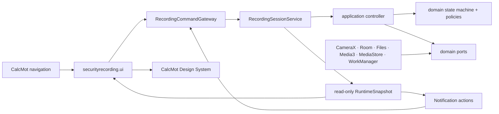
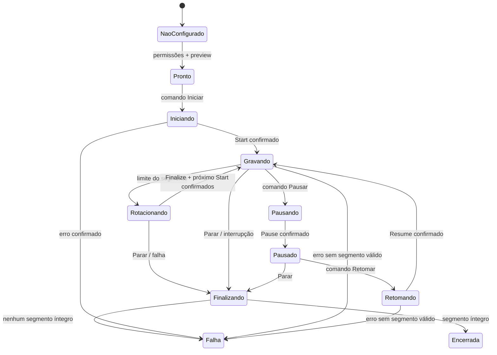
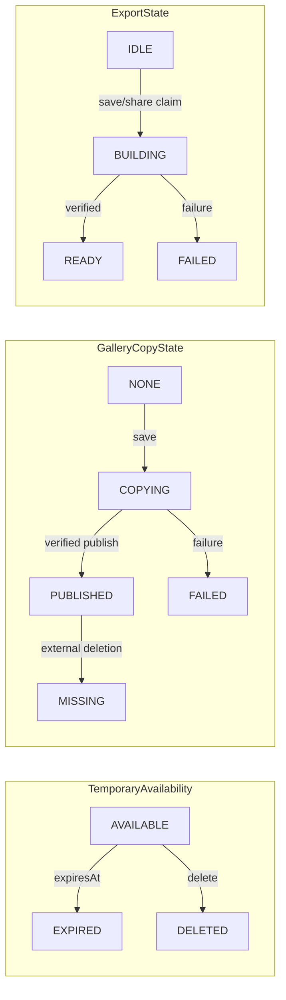
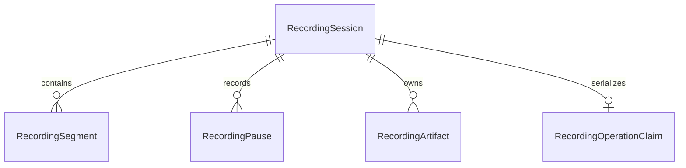

# Architecture Spine — CalcMot — Gravação de segurança com áudio e vídeo

## Design Paradigm

**Ports & Adapters orientado por máquina de estados, empacotado como vertical slice no módulo `:app`.** O domínio puro contém reducer, políticas e ports; a aplicação serializa comandos; adapters Android implementam câmera, serviço, persistência, mídia, notificação e limpeza; Compose apenas projeta snapshots e envia comandos.



`securityrecording` não possui seta de dependência para `accessibility`, `processor`, `ninetynine`, `overlay`, `finance` ou telemetria de oferta. Esses pacotes também não podem iniciar ou controlar gravações.

## Invariants & Rules

### AD-1 — Fronteira isolada da produção [ADOPTED]

- **Binds:** CAP-1–CAP-8; Uber/99/OCR/AccessibilityService/overlay/cálculos/dashboard.
- **Prevents:** regressão nos pipelines de produção e compartilhamento acidental de estado sensível.
- **Rule:** toda a feature vive em `br.com.calcmot.securityrecording`; usa banco, diretório, worker, serviço e provider próprios. Os únicos seams globais permitidos são dependências Gradle, declarações no Manifest, regras de backup/transferência, bootstrap não bloqueante em `CalcMotApplication`, rotas em `CalcMotNavigation`, Design System e asserções em `ReleaseReadinessTest`. O bootstrap apenas agenda reconciliação/limpeza em IO, não inicia serviço/câmera/microfone e falha isoladamente. É proibido importar ou referenciar `accessibility`, `processor`, `ninetynine`, `overlay` ou `finance`, reutilizar `CalcMotFinanceDatabase`, relacionar gravação a oferta/corrida/plataforma ou fazer Uber/99 disparar captura.

### AD-2 — Máquina de estados com escritor único [ADOPTED]

- **Binds:** CAP-2, CAP-3, CAP-8; tela, serviço, notificação e biblioteca.
- **Prevents:** `REC` otimista, comandos concorrentes e estados divergentes entre superfícies.
- **Rule:** `RecordingSessionService` é o único escritor de `CapturePhase` e segmentos enquanto a sessão está ativa. UI e notificação enviam `RecordingCommand` pelo mesmo gateway; comandos e callbacks CameraX entram em uma fila serial. Toda mutação usa/incrementa a única `sessionRevision` persistida; comandos contêm `commandId` e `expectedSessionRevision`, duplicata é idempotente e revisão obsoleta é rejeitada. `Iniciar`, `Pausar`, `Retomar`, rotação e `Parar` só concluem após evento confirmado. Entre o `Finalize` de um segmento e o Start do próximo, a fase é `Rotacionando`, `REC=false`, a notificação diz “Trocando segmento” e somente Parar é aceita. O binder expõe somente `RecordingRuntimeSnapshot` read-only; a notificação deriva do mesmo snapshot. `TemporaryAvailability`, `GalleryCopyState` e `ExportState` são eixos ortogonais à captura.





### AD-3 — Ciclo de vida foreground explícito e não reiniciável [ADOPTED]

- **Binds:** CAP-2, CAP-3, CAP-8.
- **Prevents:** captura silenciosa, retomada ilegal em background e `REC` sobrevivendo ao processo real.
- **Rule:** somente uma Activity CalcMot visível, após permissões, aviso e `SecurityRecordingBootstrap.bootstrapReady`, pode criar o serviço `camera|microphone`; o gateway aguarda recovery antes de chamar `startForegroundService`. O serviço é `android:exported="false"`, promove foreground dentro do prazo com snapshot/notificação bootstrap `Iniciando` sem `REC`, depois abre CameraX; somente Start confirmado projeta `Gravando`. Retorna `START_NOT_STICKY`. Remover recentes não o encerra. Enquanto pausado, o mesmo `Recording` e FGS permanecem vivos para aceitar Retomar pela notificação, sem anexar áudio/vídeo. Morte do processo ou reboot encerra a sessão; nenhum receiver, alarm, WorkManager ou autorestart retoma câmera/microfone.

### AD-4 — Configuração efetiva imutável durante a sessão [ADOPTED]

- **Binds:** CAP-1, CAP-2.
- **Prevents:** troca de encoder/lente com lacuna oculta e qualidade não validada.
- **Rule:** câmera frontal é padrão quando disponível; lente, orientação e qualidade efetiva são confirmadas no preview e congeladas de `Iniciando` até `Finalizando`. Trocar lente/orientação exige encerrar e criar outra sessão. A orientação é a do dispositivo em `Iniciar`; rotação física posterior não reconfigura a captura. A versão inicial oferece 480p/`SD`, sem fallback silencioso para 720p. Lente sem perfil aprovado fica indisponível. 720p só entra no `QualityPolicy` após AD-14.

### AD-5 — Sessão lógica composta por segmentos íntegros [ADOPTED]

- **Binds:** CAP-2, CAP-4, CAP-6, CAP-7, CAP-8.
- **Prevents:** biblioteca fragmentada, perda total por corrupção do último arquivo e exports com ordem divergente.
- **Rule:** `RecordingSession` é o agregado visível e contém `RecordingSegment` imutáveis, ordenados por índice persistido. Cada segmento termina pela duração escolhida ou por 1 GiB, o que vier primeiro. Limite entra em `Rotacionando`, remove `REC`, finaliza/verifica o arquivo e só retorna a `Gravando` após novo Start confirmado. Início/fim monotônicos e lacuna entre segmentos são persistidos; lacunas e interrupções nunca são omitidas. Playback usa playlist; salvar/compartilhar sessão multi-segmento usa MP4 canônico único.

### AD-6 — Admissão de armazenamento preserva finalização e exportação [ADOPTED]

- **Binds:** CAP-2, CAP-6, CAP-8.
- **Prevents:** preencher o disco e terminar com evidência não finalizável ou impossível de exportar.
- **Rule:** antes de iniciar/rotacionar, `usableBytes >= finalizedSessionBytes + 2 × estimatedNextSegmentBytes + 512 MiB`. A estimativa inicial vem do perfil medido da qualidade/aparelho e é recalibrada pelo bitrate real. Durante captura, bytes e espaço livre são monitorados; quando o espaço restante deixar de cobrir o tamanho atual da sessão mais 512 MiB, o serviço finaliza e para com `STORAGE_LOW`. Não há limite total fixo enquanto a reserva for mantida. Alterar 1 GiB ou 512 MiB exige benchmark e atualização deste AD.

### AD-7 — Checkpoint e recuperação são fail-closed

- **Binds:** CAP-3, CAP-4, CAP-8.
- **Prevents:** arquivo parcial apresentado como prova e perda dos segmentos já válidos.
- **Rule:** `SecurityRecordingBootstrap` executa recovery uma vez por `processEpoch` sob gate exclusivo; Start, worker e claims aguardam `bootstrapReady`. Em processo novo, qualquer linha ativa pertence ao processo morto e é reconciliada antes de nova captura. `RecordingRepository` é o único gateway durável. Serviço possui `CapturePhase`/segmentos ativos; pós-terminal exige `RecordingOperationClaim(sessionId único, operationId, kind, baseRevision, processEpoch, status)` e CAS por `sessionRevision`. Status segue `CLAIMED → COMMITTING → concluído` ou `ROLLBACK_REQUIRED`; a claim só é removida após commit/rollback durável, e recovery resolve claims não terminais. Mutex em memória não é requisito de correção. Arquivo segue intenção → `.pending` → close/fsync → verify → rename atômico no mesmo filesystem → CAS disponível; delete segue `DELETE_PENDING` → unlink → tombstone. O verifier exige container legível, duração positiva, áudio+vídeo e metadados coerentes; SHA-256 detecta corrupção interna sem alegar autenticidade. Arquivo sem callback só é recuperado se passar integralmente; com segmento válido a sessão fica disponível com `completionReason` de interrupção; sem nenhum, é `Falha`.

### AD-8 — Dois relógios, uma duração pública

- **Binds:** CAP-2, CAP-3, CAP-4, CAP-5, CAP-8.
- **Prevents:** timer divergente do vídeo e retenção afetada por pausa ou timezone.
- **Rule:** duração capturada usa relógio monotônico/estatística confirmada do Recorder e congela durante pausa; é o valor único de tela, notificação, biblioteca, player e export. Instantes de criação/finalização/expiração usam epoch UTC; timezone existe só na apresentação. Pausas e lacunas são metadados separados. `expiresAt` começa na finalização/reconciliação do conteúdo válido, nunca no início da captura.

### AD-9 — Retenção é uma política do agregado

- **Binds:** CAP-4, CAP-5, CAP-6, CAP-7.
- **Prevents:** prazo retroativo, extensão infinita acidental e reaparecimento de item expirado.
- **Rule:** a faixa 24h/3d/7d/15d/30d é fotografada ao iniciar; mudar o padrão afeta só sessões futuras. `Manter por mais tempo` só eleva um temporário não expirado a uma faixa total posterior desde `finalizedAt`, nunca reduz e nunca supera 30 dias. Expiração lógica (`expiresAt <= now`) muda `TemporaryAvailability` imediatamente e impede novos claims. Limpeza aguarda bootstrap, captura terminal e ausência de claim; operação iniciada antes da expiração pode concluir, mas não reativa o temporário. Segmentos/work são apagados na limpeza; share staging já entregue segue a janela física de AD-10 sem permanecer consultável. Exclusão roda no startup, biblioteca, após finalização e em worker próprio. `GalleryCopyState=PUBLISHED` é independente e nunca é apagado pela retenção privada.

### AD-10 — Exportar, preservar e compartilhar são independentes

- **Binds:** CAP-4, CAP-6, CAP-7, CAP-8.
- **Prevents:** compartilhar estender retenção, cópia parcial publicada e exportações concorrentes.
- **Rule:** salvar e montar o artefato canônico usam claim/CAS, são single-flight e idempotentes; cada comando explícito `Compartilhar` é repetível e abre novo Sharesheet sem declarar conclusão no receptor. Eixos temporário/galeria/export mudam independentemente. Um segmento usa staging; múltiplos usam `SessionMediaAssembler`/Media3 atrás de port. Galeria API 29+: intenção com `artifactId`, montagem `work/`, insert `IS_PENDING`, copy/close/verify, publish e CAS `PUBLISHED`. API 24–28, após `WRITE_EXTERNAL_STORAGE`: copiar staging para `Movies/CalcMot/.<artifactId>.pending` sem extensão MP4, fsync/verificar, renomear atomicamente para `<artifactId>.mp4` no mesmo diretório, executar `MediaScannerConnection` e só então persistir URI legível; recovery remove/reconcilia pendências. Share nasce `share/<artifactId>.pending` e só vira `.mp4` após verify; FileProvider não exportado `${applicationId}.securityrecording.files` expõe somente `share/`. O artefato fica logicamente indisponível com o temporário, mas fisicamente até `max(expiresAt, lastShareLaunchedAt + 1 hora)`; então grants são revogados e o arquivo apagado. Essa janela não reabre biblioteca nem preserva sessão.

### AD-11 — Permissões são contextuais e completas

- **Binds:** CAP-1, CAP-2, CAP-3, CAP-6, CAP-8.
- **Prevents:** gravação sem controle visível, `SecurityException` e permissão ampla antecipada.
- **Rule:** `CAMERA`, `RECORD_AUDIO`, `FOREGROUND_SERVICE`, `FOREGROUND_SERVICE_CAMERA` e `FOREGROUND_SERVICE_MICROPHONE` são declaradas para o serviço próprio. Câmera e microfone autorizados são pré-condições de preview/início. Em API 33+, `POST_NOTIFICATIONS` e canal operacional habilitado também são pré-condições de Iniciar. Em API 24–28, `WRITE_EXTERNAL_STORAGE` com `maxSdkVersion=28` é solicitado somente ao Salvar na galeria. Negativa leva a `Não configurado`; não há modo só áudio ou só vídeo.

### AD-12 — Dados permanecem locais e minimizados

- **Binds:** CAP-4–CAP-8; privacidade e non-goals.
- **Prevents:** backup/upload acidental, correlação com passageiros e vazamento por diagnóstico.
- **Rule:** `calcmot_recordings.db`, seus `-wal/-shm` e todo `files/security-recording/` são excluídos de cloud backup e device transfer em `backup_rules.xml` e `data_extraction_rules.xml`. IDs/filenames são UUIDs opacos; MP4 não recebe geolocalização; não há passageiro, endereço, oferta, plataforma ou corrida nos metadados. O sandbox Android protege temporários, sem criptografia customizada. Nenhum URI, filename, hash, horário, duração, tamanho, mídia ou estado de sessão é enviado ao Firebase; diagnóstico é local, enumerado e sanitizado.

### AD-13 — Falhas de recurso encerram de forma controlada

- **Binds:** CAP-2, CAP-3, CAP-8.
- **Prevents:** autoretry silencioso e arquivo corrompido após preempção ou aquecimento.
- **Rule:** permissão revogada, câmera/microfone indisponível, erro do Recorder, storage baixo ou integridade inválida removem `REC`, finalizam quando seguro e preservam apenas segmentos verificados. Não há retry automático. Em API 29+, `THERMAL_STATUS_SEVERE` ou superior dispara parada controlada; APIs anteriores dependem dos erros do engine e da qualificação por aparelho. Códigos de falha são fechados e mapeados para causa/próxima ação fora do domínio.

### AD-14 — Release exige evidência técnica e conformidade

- **Binds:** CAP-1–CAP-8; publicação Play Store.
- **Prevents:** declarar suporte não testado, publicar base jurídica presumida e relaxar salvaguardas Uber/99.
- **Rule:** release exige matriz aprovada de aparelhos/APIs cobrindo preview/capture, A/V sync, rotação, pausa/retomada, tela apagada, recentes, chamadas, memória, térmica, storage, processo morto, reboot, recuperação, retenção, galeria e export/share. 720p só após comparação formal com 480p. Jurídico/produto aprova base jurídica/transparência; privacidade, Data Safety e declaração Play de FGS são atualizadas. A antiga asserção que remove `FOREGROUND_SERVICE` é substituída por asserções estritas para serviço `camera|microphone`, provider/serviço não exportados, paths de share/backup restritos e ausência de mediaProjection/boot. Todas as asserções comportamentais e de isolamento Uber/99 permanecem literalmente inalteradas. O build verifica convergência exata CameraX 1.6.1 e Media3 1.11.0.

## Consistency Conventions

| Concern | Convention |
| --- | --- |
| IDs | `SessionId`, `SegmentId`, `ArtifactId` e `CommandId` são UUIDs opacos. |
| Commands | Envelope tipado `{commandId, expectedSessionRevision, payload}`; efeito só após reducer aceitar e adapter confirmar. |
| State | `CapturePhase` preserva `recording-lifecycle.md` e acrescenta `Rotacionando`; interrupção é `completionReason`. `TemporaryAvailability`, `GalleryCopyState` e `ExportState` são ortogonais. `REC` equivale somente a `Gravando`. |
| Time | `*AtEpochMillis` para UTC; `*DurationNanos`/`*GapMillis` para monotônico; duração pública exclui pausas. |
| Sizes/integrity | Bytes em `Long`; SHA-256 lowercase; desconhecido é nulo/estado explícito, nunca zero sentinela. |
| Files | Segmentos: `sessions/<sessionId>/segments/<index>-<segmentId>.pending|.mp4`; montagem privada: `work/<artifactId>.pending|.mp4`; share: `share/<artifactId>.pending|.mp4`. Só `share/*.mp4` validado é concedido. |
| Errors | `RecordingFailureCode` fechado: permission, camera, microphone, storage, thermal, process, finalize, integrity, export, MediaStore. |
| Database | `calcmot_recordings.db`, schema/migrations próprios; uma `sessionRevision` CAS; claim durável único por sessão com `operationId/kind/processEpoch/status`; configuração, sessões, segmentos, pausas e artefatos pertencem ao repositório. |
| Artifact protocol | Intenção DB → `.pending` → close/fsync → verify → atomic rename/publish → CAS; delete usa `DELETE_PENDING` → unlink → tombstone; recovery resolve claims não terminais. |
| Share lifetime | `availableUntil = max(expiresAt, lastShareLaunchedAt + 1h)` apenas para limpeza física; disponibilidade lógica continua limitada por `expiresAt`. |
| Work | Unique work `calcmot_security_recording_cleanup`; aguarda bootstrap/recovery e nunca chama `LedgerMaintenanceWorker`. |
| Notification | Canal/notification ID estáveis; PendingIntents explícitos, imutáveis e versionados. |

## Stack

| Name | Version |
| --- | --- |
| Android | minSdk 24 · compileSdk 36 · targetSdk 36 |
| Kotlin / JVM | Kotlin efetivo 2.2.10 via AGP built-in · bytecode Java 11 · Gradle JDK 17+ |
| Android Gradle Plugin | 9.0.0 — pin brownfield |
| Jetpack Compose | BOM 2025.09.01 — pin brownfield |
| CameraX | 1.6.1 |
| Media3 ExoPlayer / Transformer | 1.11.0 |
| Room | 2.8.4 |
| WorkManager | 2.11.2 |

## Structural Seed

```text
app/src/main/java/br/com/calcmot/securityrecording/
  domain/          # máquina de estados, entidades, políticas e ports puros
  application/     # controller, comandos e casos de uso serializados
                    # bootstrap gate único por processEpoch
  platform/
    capture/       # adapter CameraX
    service/       # RecordingSessionService e gateway de intents
    persistence/   # Room, filesystem, recovery e integrity verifier
    media/         # player, Media3 assembler, MediaStore e FileProvider
    notification/  # projeção do RuntimeSnapshot e PendingIntents
    cleanup/       # expiração lógica e RecordingCleanupWorker
  ui/              # rotas Compose, permissões, preview, controle e biblioteca
```



```text
files/security-recording/
  sessions/       # segmentos privados; nunca expostos por provider
  quarantine/     # pending inválido até reconciliação/exclusão
  work/           # montagem privada para galeria; não exposta
  share/          # único subtree permitido no FileProvider
databases/
  calcmot_recordings.db[-wal|-shm]
```

```mermaid
flowchart TB
    DEVICE[Android device · single app process]
    DEVICE --> FGS[RecordingSessionService camera|microphone]
    FGS --> PRIVATE[App-private DB + media]
    PRIVATE --> PLAYER[In-app Media3 playback]
    PRIVATE --> STORE[MediaStore gallery copy]
    PRIVATE --> SHARE[Android Sharesheet via FileProvider]
    DEVICE -. no backend/upload/remote config .-> NONE[No external CalcMot service]
```

## Capability → Architecture Map

| Capability / Area | Lives in | Governed by |
| --- | --- | --- |
| CAP-1 — configuração, permissões e preview | `ui`, `platform.capture`, preferences | AD-4, AD-11, AD-14 |
| CAP-2 — iniciar, pausar, retomar e parar | state machine, controller, CameraX | AD-2–AD-5, AD-8, AD-13 |
| CAP-3 — background, recentes e notificação | service, notification adapter | AD-2, AD-3, AD-11, AD-14 |
| CAP-4 — biblioteca e reprodução | repository, verifier, Media3 player | AD-5, AD-7–AD-9 |
| CAP-5 — retenção e limpeza | retention policy, cleanup worker | AD-8, AD-9, AD-12 |
| CAP-6 — salvar na galeria | assembler, verifier, MediaStore | AD-6, AD-10–AD-12 |
| CAP-7 — compartilhar | assembler, FileProvider, Sharesheet | AD-10, AD-12 |
| CAP-8 — estado/arquivo verdadeiros | ports/adapters operacionais | AD-2, AD-5–AD-14 |
| Isolamento Uber/99 | package boundary e release gate | AD-1, AD-14 |

## Deferred

- **[BLOCKER ANTES DE HISTÓRIAS] Adoção no SPEC.** Atualizar `recording-lifecycle.md` para incorporar a fase técnica `Rotacionando` sem `REC` e os eixos ortogonais temporário/galeria/export, mantendo os IDs CAP e AD estáveis.
- **[BLOCKER DE RELEASE] Base jurídica e transparência ao passageiro no Brasil.** Dono: jurídico/produto. Reabrir com texto/base formalmente aprovados; reconciliar política de privacidade, Data Safety e materiais Play.
- **[BLOCKER DE RELEASE] Matriz de aparelhos-alvo.** Dono: produto/QA. Reabrir quando modelos/OEMs e APIs forem nomeados; executar AD-14 antes de declarar suporte.
- **720p.** Fora do `QualityPolicy` inicial. Reabrir apenas com benchmark comparável demonstrando qualidade adequada, consumo equivalente e comportamento térmico/A-V não inferior a 480p.
- **Otimizações internas de exportação.** Transmux versus transcode, paralelismo e cache são detalhe do adapter desde que preservem AD-6, AD-7 e AD-10.
- **Composição visual final.** Permanece com os companions UX e validação por Preview/screenshot real; não altera esta spine.
- **Backend, backup, upload, live stream, processo separado e integração com apps de transporte.** Fora do escopo; exigem novo SPEC e nova arquitetura.
